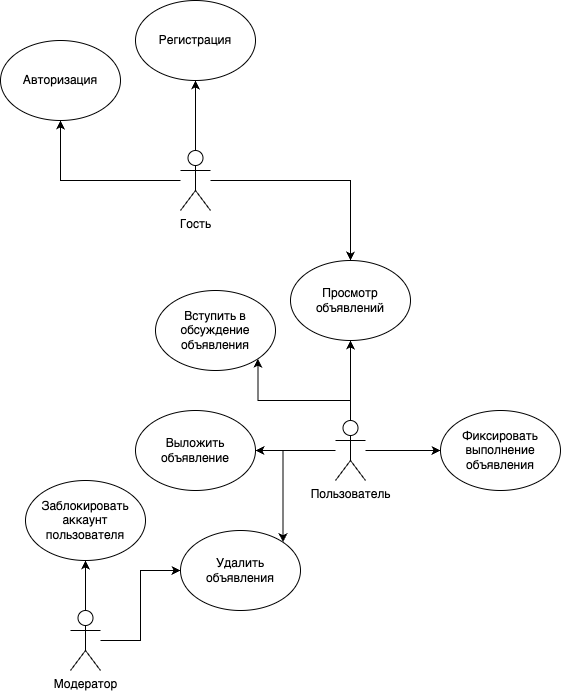
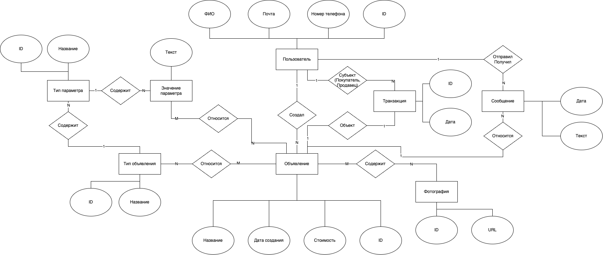
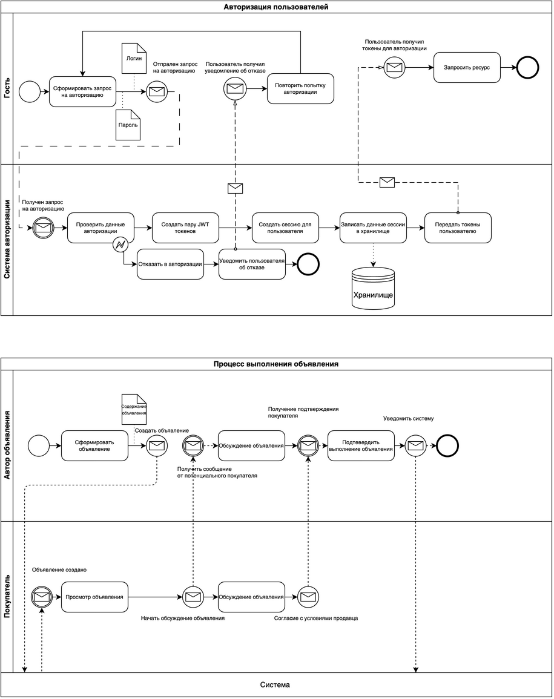

# ППО

## Название проекта

Maweituo

## Краткое описание идеи проекта

Интернет-сервис объявлений о товарах.

Предоставить возможность выкладывать объявления о товарах, вступать в обсуждения и договариваться о выполнении объявлений других пользователей.

## Краткое описание предметной области

Предметная область - объявления о товарах.

Интернет-сервис объявлений о товарах - это онлайн платформа, где пользователи могут размещать и просматривать объявления о продаже или покупке различных товаров и услуг. Сервис обеспечивает удобный способ поиска необходимого товара, сравнения цен, общения с продавцами и заключения сделок. Пользователи могут использовать фильтры, чтобы быстро найти интересующий их товар и оставлять отзывы о продавцах и товарах.

## Краткий анализ аналогичных решений по 4 критериям

|решение|предметная область|Обеспечение безопасности|Кто может выставлять объявления|Агрегация|
|--|--|--|--|--|
|Avito|Товары,услуги|Автоматически, ручная модерация|Любой пользователь|+|
|Циан|Недвижимость|Ручная модерация|Подтвержденные лица|+|
|Auto.ru|Автомобили|Ручная модерация|Подтвержденные лица|+|
|Перепродажа одежды N|Одежда|Ручная модерация|Любой человек|-|

## Актуальность 

Интернет-сервисы объявлений о товарах предсотавляют людям возможность догавариваться о покупке или продаже товаров дистанционно. Однако, на популярных торговых площадках, такие как Авито, оперирует большое число мошенников. Это вынуждает мелкие компании создавать свои площадки, к примеру, через чат-ботов. Этот проект может использоваться в качестве такого сервиса, предоставляя стандартные способы обработки объявлений.

## Описание ролей

**Гость** - неавторизованый пользователь, который имеет возможность просматривать все объявления на сайте, зарегестрироваться и авторизоваться.

**Пользователь** - авторизованый пользователь. Соответсвет одному человеку, который может выложить обьявления, видные всем на сайте, связываться и отвечать на объявления других пользователей.

**Модератор** - авторизованый пользователь с особыми правами управления и модерации над объявлениями пользователей.

## Use-Case диаграмма

## ER диаграмма

## Сложные сценарии

#### Алгоритм рекомендации

Batch-задача, производящая анализ истории покупок и просмотров пользователем объявлений и составляющая список похожих объявлений, которые будут предложены пользователю как похожие.

#### Обсуждение объявления

Пользователь должен иметь возможность вступить в чат с другим пользователем для обсуждения условий его объявления. Если обсуждение было успешно, пользователи договариваются и фиксуируют выполнение условий объявления, занося его в историю.

## Пользовательские сценарии

**Гость** может:
- посмотреть все объявления на сайте
- авторизоваться
- зарегестрироваться

После авторизации гость становится *пользователем*.

**Пользователь** может:
- посмотреть все объявления на сайте
- выложить объявление
- удалить объявления
- начать обсуждение по объявлению другого пользователя
- фиксировать выполнение объявления

**Модератор** может:
- удалить объявление произвольного пользователя 
- заблокировать аккаунт пользователя

## BPMN-диаграмма

