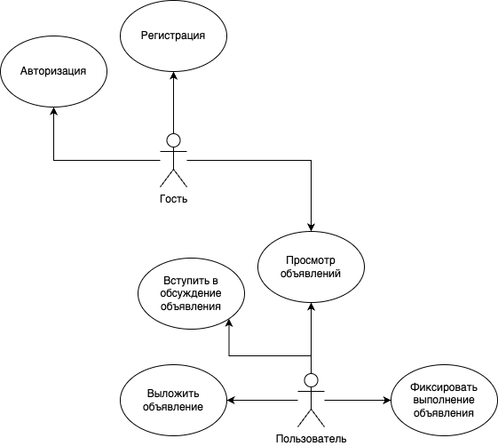
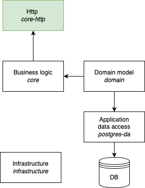
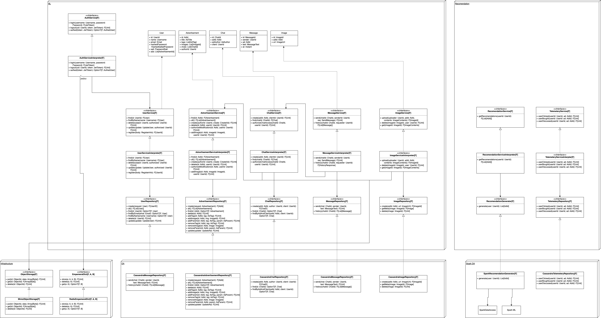

# ППО

## Название проекта

Maweituo

## Краткое описание идеи проекта

Интернет-сервис объявлений о товарах.

Предоставить возможность выкладывать объявления о товарах, вступать в обсуждения и договариваться о выполнении объявлений других пользователей.

## Краткое описание предметной области

Предметная область - объявления о товарах.

Интернет-сервис объявлений о товарах - это онлайн платформа, где пользователи могут размещать и просматривать объявления о продаже или покупке различных товаров и услуг. Сервис обеспечивает удобный способ поиска необходимого товара, сравнения цен, общения с продавцами и заключения сделок. Пользователи могут использовать фильтры, чтобы быстро найти интересующий их товар и оставлять отзывы о продавцах и товарах.

## Краткий анализ аналогичных решений по 4 критериям

|решение|предметная область|Обеспечение безопасности|Кто может выставлять объявления|Агрегация|
|--|--|--|--|--|
|Avito|Товары,услуги|Автоматически, ручная модерация|Любой пользователь|+|
|Циан|Недвижимость|Ручная модерация|Подтвержденные лица|+|
|Auto.ru|Автомобили|Ручная модерация|Подтвержденные лица|+|
|Перепродажа одежды N|Одежда|Ручная модерация|Любой человек|-|

## Актуальность 

Интернет-сервисы объявлений о товарах предоставляют людям возможность договариваться о покупке или продаже товаров дистанционно. Однако, на популярных торговых площадках, такие как Авито, оперирует большое число мошенников. Это вынуждает мелкие компании создавать свои площадки, к примеру, через чат-ботов. Этот проект может использоваться в качестве такого сервиса, предоставляя стандартные способы обработки объявлений.

## Описание ролей

**Гость** - неавторизованый пользователь, который имеет возможность просматривать все объявления на сайте, зарегистрироваться и авторизоваться.

**Пользователь** - авторизованный пользователь. соответствует одному человеку, который может выложить объявления, видные всем на сайте, связываться и отвечать на объявления других пользователей.

## Use-Case диаграмма



## ER диаграмма


## ER диаграмма рекомендательной системы


## Сложные сценарии

#### Алгоритм рекомендации

В крупных рекомендательных системах домен строго определен, к примеру, как в Spotify. 
Известно, что в рекомендательном алгоритме Spotify выдается набор ординальных метрик каждой песни. 
Далее применяется алгоритм факторизации матриц (сингулярное разложение), позволяющий выделить набор латентных признаков. 
На основе полученной матрицы признаков строится метрическое пространство, к которому применяется алгоритм Annoy, основанный на KNN (Random projection trees).

Особенностью данного проекта является отсутствие привязки к конкретной области. 
Из-за этого отсутствует возможность выделить ординальные параметры, что делает невозможным применение алгоритмов, основанных на линейной алгебре. 
Однако, система может быть представлена в виде графа. 
Также существует возможность применения алгоритма KNN для графов. 
Для простоты, будет рассматриваться 1 тип явной (explicit) и 2 типа неявной (implicit) метрик: явной метрикой является история транзакций пользователя, а неявной - просмотренные объявления и объявления, по которым было начато обсуждение, но не закончено. 

Пусть M - число типов объявлений.
Назовем M-мерный числовой вектор вектором предпочтений пользователя.
Таким образом осуществляется переход от не ординальных типовых значений к ординальным, позволяя применять статистические алгоритмы.

Подбор объявления для конкретного пользователя строится на стохастическом обходе вершин графа, являющихся соседним к пользователю. 
Такими могут быть другие пользователи. 
Среди таких пользователей выбираются такие, расстояние между матрицами метрик которых самые низкие. 
Расстояние может задаваться как расстояние между векторами. 
В простейшем случае может быть взять евклидово расстояние.

Таким образом образовывается множество из n пользователей, интересы которых совпадают. 
Среди них на основе какой-либо эвристики выбираются объявления, которые следует показать пользователю. 
Эвристикой, к примеру, могут быть последние просмотренные объявления, или объявления, автором которых является рассматриваемый пользователь. 

Может сложиться ситуация, при которой одним и тем же пользователям показываются одни и те же товары. 
Можно предложить два подхода для решения такой проблемы. 

Во-первых, при каждой рекомендации можно менять матрицу метрики пользователя случайным образом, добавляя шум. 
Из-за того, что обход графа стохастический, можно гарантировать отсутствие повторяющихся результатов до какого-то момента. 
Во-вторых, параллельно стохастическому обходу пользователя по соседним пользователям можно вести обход для некоторых товаров, интересных пользователю.

#### Обсуждение объявления

Пользователь должен иметь возможность вступить в чат с другим пользователем для обсуждения условий его объявления. Если обсуждение было успешно, пользователи договариваются и фиксируют выполнение условий объявления, занося его в историю.

## Пользовательские сценарии

**Гость** может:
- просмотреть все объявления на сайте
- просмотреть информацию об аккаунтах пользователей, выложивших объявления
- авторизоваться
- зарегистрироваться

После авторизации гость становится *пользователем*.

**Пользователь** может:
- посмотреть все объявления на сайте
- выложить объявление
- начать обсуждение по объявлению другого пользователя
- отправить сообщение по обсуждению объявления
- фиксировать выполнение объявления
- добавить фотографию в свое объявление
- удалить фотографию из своего объявления
- добавить тег или параметр к своему объявлению
- удалить тег или параметр у своего объявления

## BPMN-диаграмма


## Описание типа приложения и выранного технологического стека

Язык: Scala

Интерфейс: SPA

СУБД: ScyllaDB, Clickhouse

## Верхнеуровневое разбиение на компоненты



## UML



## API 

```
POST   /register  
POST   /login 
POST   /logout 

GET    /users/{user_id}           - get user info
DELETE /users/{user_id}           - delete user 
PUT    /users/{user_id}           - update user  
GET    /users/{user_id}/ads       - get ads created by user

GET    /ads/{ad_id}               - get advertisement info
PUT    /ads/{ad_id}               - update advertisement
DELETE /ads/{ad_id}               - delete advertisement
POST   /ads/{ad_id}/img           - upload image
GET    /ads/{ad_id}/img/{img_id}  - get image 
DELETE /ads/{ad_id}/img/{img_id}  - delete image 
POST   /ads/{ad_id}/resolved      - mark advertisement as resolved
GET    /ads/{ad_id}/chat          - get chat for current user
POST   /ads/{ad_id}/chat          - create chat for current user 
POST   /msg/{ad_id}/msg/{chat_id} - send message
GET    /msg/{ad_id}/msg/{chat_id} - get chat history
POST   /ads/{ad_id}/tag           - add tag
DELETE /ads/{ad_id}/tag           - delete tag

GET    /feed/{user_id}            - get personalized feed
GET    /feed                      - get global feed

GET    /tags                      - get all tags 
GET    /tags/{tag}/ads            - get all advertisements with given tag

```